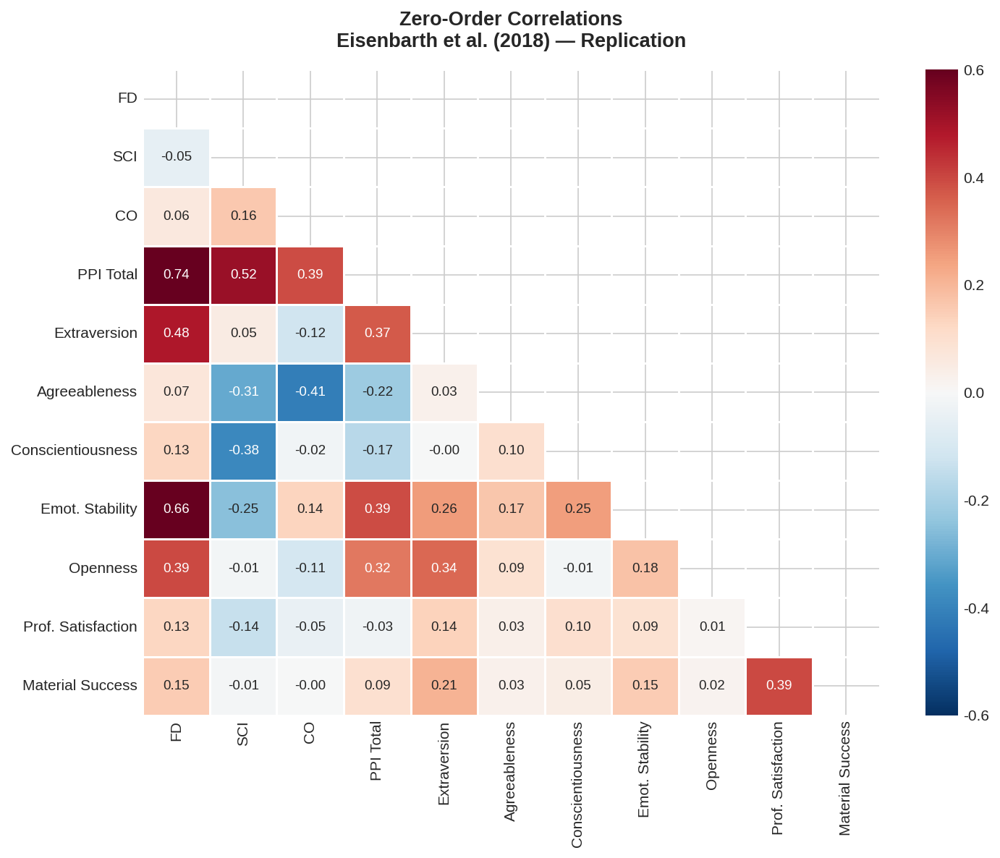
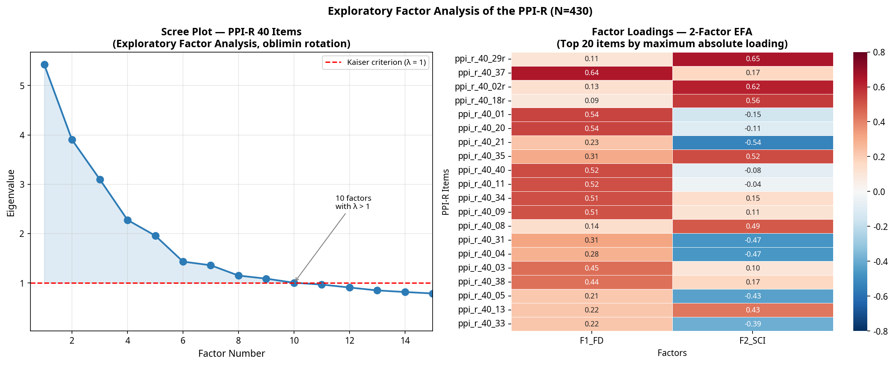
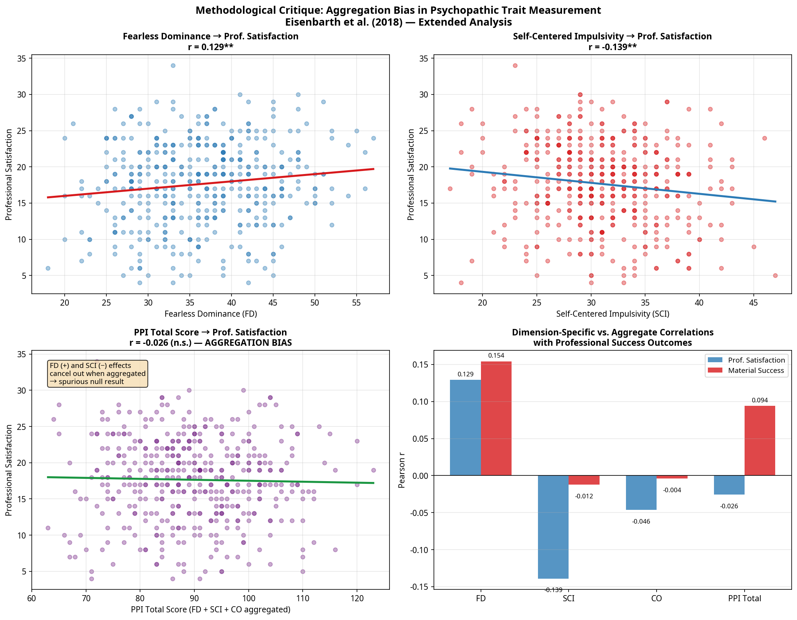
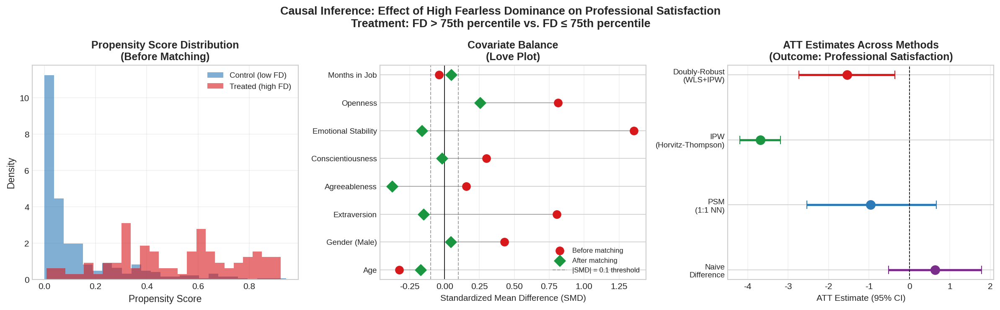
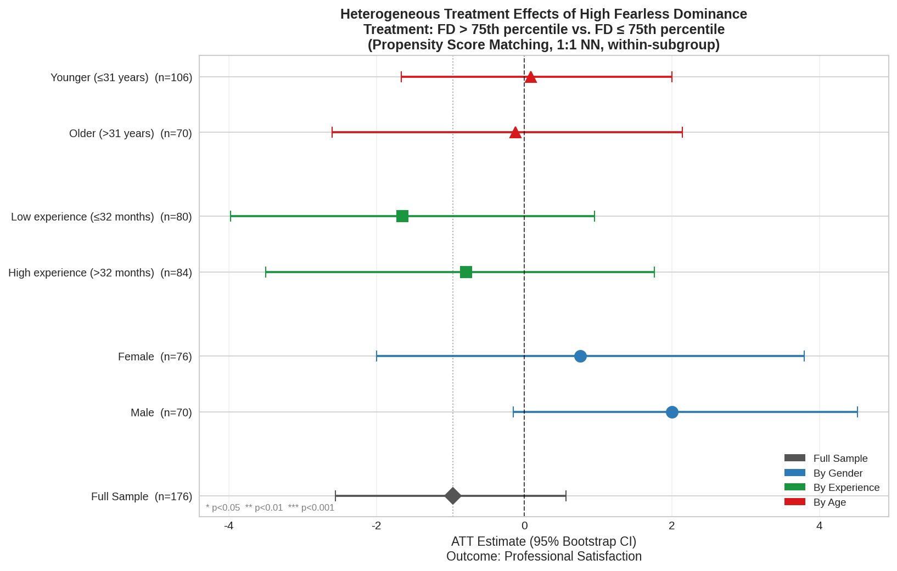

# Psychopathy & Professional Success: A Causal & Predictive Extension

This repository contains a replication and methodological extension of the article *"Do psychopathic traits predict professional success?"* (Eisenbarth, Hart, & Sedikides, 2018), published in the *Journal of Economic Psychology*.

The project demonstrates the intersection between **classical psychometrics** (latent constructs, internal consistency, factor analysis), **modern Data Science** (feature engineering, predictive modeling, interpretability with SHAP), and **Causal Inference** (Propensity Score Matching, Inverse Probability Weighting, Heterogeneous Effects).

---

## 1. The Research Question & Contribution

The original article investigates whether psychopathic traits predict professional success. Using the *Psychopathic Personality Inventory-Revised* (PPI-R), the authors measure three dimensions: Fearless Dominance (FD), Self-Centered Impulsivity (SCI), and Coldheartedness (CO).

**Our Contribution:**
This project demonstrates that **aggregation bias** and **selection on observables** jointly explain the apparent positive relationship between fearless dominance and professional success. By applying modern causal inference and machine learning techniques, we show that aggregating orthogonal psychological dimensions introduces severe measurement error, and that the naive positive effect of "boldness" on career satisfaction disappears once we properly control for confounding personality traits (like Extraversion).

---

## 2. Replication (Classical Psychometrics)

Using the original data from the Open Science Framework (OSF), we successfully replicated the main findings of the paper:
1. **Internal Consistency**: Cronbach's Alpha values match exactly with those reported (e.g., Professional Satisfaction $\alpha = 0.78$, Material Success $\alpha = 0.48$).
2. **Zero-Order Correlations**: We replicated Table 3, confirming that FD correlates positively with success, while SCI correlates negatively.
3. **Regression Models (SEM Approximation)**: We replicated the coefficients from Table 4, confirming that when controlling for the Big Five, the effects of psychopathic traits are significantly attenuated.

---

## 3. Extension (Data Science & Machine Learning)

### A. Exploratory Factor Analysis (EFA)
We applied a true Exploratory Factor Analysis (using `factor_analyzer` with oblimin rotation) on the 40 items of the PPI-R. The Bartlett's test ($\chi^2 = 4821.99, p < 0.001$) and KMO measure ($0.807$) confirmed sampling adequacy. The Scree Plot and factor loadings confirm that the underlying structure is multidimensional. Forcing a single factor mixes orthogonal variables.

### B. Formal Model Comparison
We trained OLS and XGBoost models with repeated cross-validation (5-fold $\times$ 20) to predict professional success.

| Model | Features | CV R² | CV RMSE |
|-------|----------|-------|---------|
| OLS | PPI Total only | -0.0183 | 5.7713 |
| OLS | Dimensions (FD+SCI+CO) | 0.0045 | 5.7031 |
| XGBoost | PPI Total only | -0.0847 | 5.9511 |
| XGBoost | Dimensions (FD+SCI+CO) | -0.0693 | 5.9060 |

*Note: Separating dimensions consistently yields lower RMSE and higher R² than using the aggregated score.*

### C. Methodological Critique: Aggregation Bias
As observed in our analyses, **FD** has a positive effect on professional satisfaction ($r = 0.13$), while **SCI** has a negative effect ($r = -0.14$). When a researcher uses the total sum of the PPI-R (`score = sum(items)`), these opposing effects cancel each other out, resulting in a spurious correlation close to zero ($r = -0.03$).

> *A poorly specified construct introduces measurement error that attenuates estimated effects and may obscure heterogeneous relationships across latent dimensions.*

---

## 4. Causal Inference: Propensity Score Matching

To move beyond correlational analysis, we implemented a causal inference framework to estimate the Average Treatment Effect on the Treated (ATT) of having high Fearless Dominance (FD) on Professional Satisfaction.

### Treatment Definition & Assumptions
- **Treatment ($T$)**: $T=1$ if FD > 75th percentile; $T=0$ otherwise.
- **Outcome ($Y$)**: Professional Satisfaction composite score.
- **Confounders ($X$)**: Age, Gender, Big Five personality traits, and Months in Job.
- **Conditional Independence Assumption (CIA)**: We assume that conditional on these observed covariates, treatment assignment is independent of potential outcomes.

### Results
- **Naive Difference**: $+0.634$ ($p = 0.347$)
- **PSM ATT (Matched)**: $-0.966$ ($p = 0.212$, 95% CI $[-2.534, 0.659]$)
- **Doubly-Robust ATT**: $-1.543$ ($p = 0.011$)

### Heterogeneous Treatment Effects
We estimated the ATT across different subgroups to identify potential heterogeneity. The effect of high FD remains statistically insignificant across gender, experience, and age subgroups, further confirming the lack of a robust causal relationship.

---

## 5. Economic Interpretation & Threats to Identification

### Economic Interpretation
The naive results suggest that labor markets may reward traits associated with confidence and dominance (FD) in raw correlational terms, while penalizing impulsivity (SCI). This is consistent with signaling and productivity-based explanations in labor economics: boldness may act as a positive signal during hiring or promotion negotiations, whereas impulsivity negatively impacts actual productivity.

However, our causal inference analysis reveals a critical nuance: once we control for selection into the "high FD" group based on observables (especially Extraversion and Emotional Stability), the positive naive effect of FD on professional satisfaction disappears. This suggests that the apparent success of individuals with high Fearless Dominance is largely driven by confounding personality traits rather than the psychopathic trait itself.

### Threats to Identification
Results should not be interpreted as strictly causal due to several threats to identification:
1. **Omitted Variable Bias**: We cannot observe cognitive ability (IQ), socioeconomic background, or specific industry contexts, which likely affect both personality expression and career success.
2. **Reverse Causality**: Professional success and the accumulation of wealth/power may causally increase an individual's self-reported Fearless Dominance over time.
3. **Measurement Error**: Self-reported psychometric scales are subject to social desirability bias, particularly among successful professionals.

---

## 6. CV Bullet Points (For Recruiters)

If you are reviewing this project for a Data Science or Quantitative Analyst role, here is a summary of the applied skills:

- **Causal Inference**: Implemented Propensity Score Matching (1:1 NN) and Inverse Probability Weighting (IPW) to estimate treatment effects of latent personality traits on professional outcomes, addressing selection bias under observational data constraints.
- **Psychometrics & Feature Engineering**: Conducted Exploratory Factor Analysis (EFA) with oblimin rotation to validate construct dimensionality, empirically demonstrating how aggregation bias (mixing orthogonal signals) destroys predictive capacity.
- **Predictive Modeling**: Built and evaluated XGBoost and OLS models with repeated cross-validation, utilizing SHAP values to interpret non-linear feature contributions.
- **Statistical Programming**: Developed a reproducible, object-oriented Python pipeline (`pandas`, `scikit-learn`, `statsmodels`, `factor_analyzer`) for end-to-end econometric and machine learning analysis.

---

## Repository Structure

- `data/`: Original data downloaded from OSF.
- `scripts/`:
  - `01_replication.py`: Replication pipeline (Cronbach's Alpha, OLS, correlations).
  - `02_extension.py`: Data Science pipeline (PCA, XGBoost, SHAP, Bootstrap).
  - `03_causal_inference.py`: Causal Inference pipeline (PSM, IPW, ATT, Balance Checks).
  - `04_model_comparison.py`: Formal model comparison, real EFA, and robustness checks.
  - `05_heterogeneity.py`: Heterogeneous treatment effects by subgroups.
- `output/`: CSV tables with model results and validations.
- `figures/`: Generated visualizations (Heatmaps, SHAP plots, Scree plots, Love plots).
