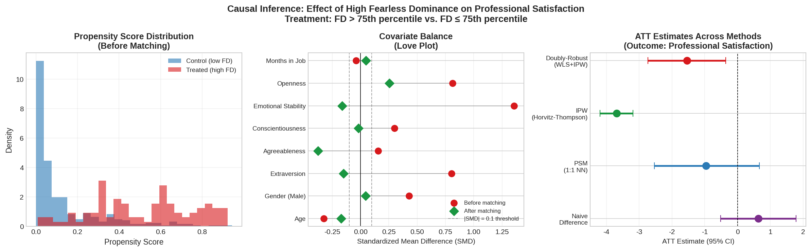

# Does Psychopathy Pay Off at Work?

**A replication and causal extension of the "fearless dominance predicts career success" claim. Spoiler: it doesn't, once you control for confounders.**

<p align="center">
  
</p>

A widely-cited paper (Eisenbarth, Hart, & Sedikides, 2018) reports that **fearless dominance** — one of the three sub-traits of psychopathy — correlates positively with professional success. This project replicates that result and then asks whether the correlation survives a proper causal-inference treatment. It doesn't.

## Headline result

Treatment: being in the top quartile of fearless dominance. Outcome: professional satisfaction.

| Method | ATT estimate | p-value |
|---|---|---|
| Naive difference | **+0.634** | 0.347 |
| Propensity Score Matching | **−0.966** | 0.212 |
| Doubly-Robust | **−1.543** | **0.011** |

The naive positive effect **disappears** once you control for the Big Five — particularly Extraversion and Emotional Stability. The "psychopathy pays off" narrative is largely the result of confounding personality traits being correlated with both fearless dominance and career outcomes.

## Why this is non-obvious

- **Aggregation bias destroys the signal.** Using the total PPI score (sum of all 40 items) yields r ≈ −0.03 with professional satisfaction — apparently null. But the sub-dimensions move in opposite directions: Fearless Dominance r = +0.13, Self-Centered Impulsivity r = −0.14. Aggregating cancels them out.
- **Exploratory Factor Analysis confirms multidimensionality.** KMO = 0.807, Bartlett's test χ² = 4,821 (p < 0.001). Forcing a single factor mixes orthogonal signals.
- **Heterogeneous Treatment Effects are flat.** The null result holds across gender, experience, and age subgroups — not a power problem.
- **The threat to identification is real but bounded.** Reverse causality (career success raising self-reported boldness over time) and omitted IQ/SES variables are documented openly.

## How it works

1. **Replication** of the original Cronbach's α, zero-order correlations, and regression coefficients.
2. **Real EFA** with oblimin rotation on the 40 PPI-R items (most "EFA" reports in this literature are PCA in disguise).
3. **Predictive modelling**: OLS vs XGBoost with repeated 5-fold × 20 CV. Separating dimensions consistently improves R² over the aggregated score.
4. **Causal inference**: Propensity Score Matching (1:1 nearest neighbour) + Inverse Probability Weighting + Doubly-Robust estimator. Balance checks before and after matching.
5. **Heterogeneity**: ATT estimated within gender, age, and experience subgroups.

## Stack

Python · scikit-learn · statsmodels · `factor_analyzer` · SHAP

## Run it

```bash
pip install -r requirements.txt
python scripts/01_replication.py
python scripts/02_extension.py
python scripts/03_causal_inference.py
python scripts/04_model_comparison.py
python scripts/05_heterogeneity.py
```

Data downloaded from the Open Science Framework on first run.

## More

- **Original paper**: Eisenbarth, H., Hart, C. M., & Sedikides, C. (2018). *Journal of Economic Psychology*.
- **Output tables**: [`output/`](output/)
- **All figures**: [`figures/`](figures/)
